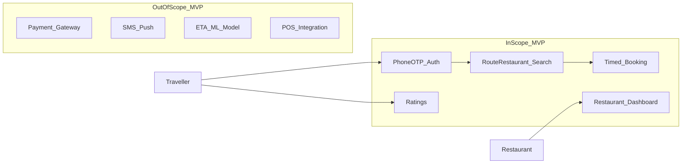

# Project Charter — Highway Food Pre-Booking Platform

**Product name:** MealsOnWheels (working title)  
**Document version:** 1.0  
**Last updated:** 2026-07-25  
**Status:** Approved for MVP build

---

## 1. Executive Summary

MealsOnWheels is a **highway food pre-booking platform** that lets travellers order food from restaurants located along their travel route so meals are **ready when they arrive**. This is not a food-delivery app. The core value proposition is **time-aligned pickup at a known stop**, not last-mile delivery to a home address.

The platform serves two primary actors:

1. **Travellers** — bus passengers, car drivers, and highway commuters who want predictable food at a specific arrival time.
2. **Restaurants** — highway dhabas, food courts, and quick-service outlets that can prepare orders against an ETA rather than on-demand courier dispatch.

---

## 2. Problem Statement

Highway travellers face a recurring friction loop:

- They are hungry but cannot predict when they will reach a suitable restaurant.
- Stopping to browse menus wastes travel time and breaks convoy or bus schedules.
- Restaurants cannot plan prep without knowing when a customer will arrive.
- Existing food-delivery apps optimize for urban last-mile delivery, not **route-corridor pickup timing**.

**Consequence:** missed meal windows, cold food, long queues at dhabas, and lost revenue for restaurants that could serve more travellers if orders were known in advance.

---

## 3. Vision

> Enable every highway traveller to pre-book a fresh meal that is ready the moment they pull off the road — without changing their route or waiting in line.

Long-term, the platform becomes the **default pre-order layer for inter-city travel**, integrating with bus operators, fleet GPS, and restaurant POS systems. AI features (ETA refinement, demand forecasting) are **extension points only** in MVP; the core product must work without them.

---

## 4. Goals (MVP)

| ID | Goal | Success indicator |
|----|------|-------------------|
| G1 | Route-aware restaurant discovery | User sees restaurants near their stop with P95 < 800 ms on a cache hit ([02_TECHNICAL_SPEC.md](./02_TECHNICAL_SPEC.md) §7) |
| G2 | Timed pre-booking | User creates booking with arrival time; restaurant sees cutoff countdown |
| G3 | Order lifecycle visibility | Status transitions visible to user and restaurant (pending → confirmed → ready → handed_over) |
| G4 | Pay-on-arrival | No payment gateway in MVP; payment abstraction documented for Phase 2 |
| G5 | Operational simplicity | Single backend deployable via Docker; zero-cost OSS stack where practical |
| G6 | Accessibility baseline | WCAG 2.1 AA targets for traveller and restaurant console flows |

---

## 5. Non-Goals (MVP)

The following are **explicitly out of scope** for the first release. See [13_ROADMAP.md](./13_ROADMAP.md) for phasing.

- Online payment processing (UPI, cards, wallets)
- SMS / push notifications (email only in MVP; push in Phase 2)
- ML-based ETA prediction (GPS ingest only; model is extension point)
- OAuth / social login (phone + OTP only)
- Restaurant POS integration
- Aggregator integrations (redBus, AbhiBus)
- Admin analytics dashboard beyond basic order stats
- Automated compliance / FSSAI verification

**Rationale:** Each of these is a product in its own right. Building them now would mean
maintaining them before the core proposition — time-aligned pickup — has been validated with
real travellers and real dhabas. Extension points are documented so Phase 2 does not require
re-architecture.

---

## 6. Personas

### 6.1 Priya — Bus Traveller

- **Age:** 28, software engineer travelling Delhi → Chandigarh weekly
- **Device:** Android phone, intermittent 4G on highway
- **Needs:** Book breakfast before boarding; know exactly when food will be ready at Murthal stop
- **Pain:** Bus stops 20 minutes; queue at dhaba eats entire break

### 6.2 Rajesh — Restaurant Owner (Highway Dhaba)

- **Age:** 45, runs family dhaba near NH-44
- **Device:** Basic Android tablet in kitchen
- **Needs:** See incoming orders with prep countdown; confirm or reject before cooking
- **Pain:** Over-prepares during rush, under-prepares when buses arrive unexpectedly

### 6.3 Ops Admin (Internal)

- **Role:** Onboard restaurants, monitor system health, handle disputes
- **Needs:** Lightweight web console; manual restaurant registration in MVP
- **Pain:** No tooling today — everything is phone calls

---

## 7. Stakeholders & Roles

This project is designed by a cross-functional engineering organization. Responsibilities map to documentation ownership:

| Role | Responsibility | Primary docs |
|------|----------------|--------------|
| CEO / CTO | Vision, scope, build-vs-buy | This charter, [13_ROADMAP.md](./13_ROADMAP.md) |
| Product Manager | Requirements, acceptance criteria | [01_PRODUCT_SPEC.md](./01_PRODUCT_SPEC.md) |
| Principal Architect | System boundaries, integration | [03_SYSTEM_ARCHITECTURE.md](./03_SYSTEM_ARCHITECTURE.md), [09_ARCHITECTURE_DECISIONS.md](./09_ARCHITECTURE_DECISIONS.md) |
| Staff Backend Engineer | API, auth, booking logic | [02_TECHNICAL_SPEC.md](./02_TECHNICAL_SPEC.md), [05_API_SPEC.md](./05_API_SPEC.md) |
| Staff Flutter Engineer | Mobile client | [07_UI_UX_GUIDELINES.md](./07_UI_UX_GUIDELINES.md), [08_DEVELOPMENT_GUIDELINES.md](./08_DEVELOPMENT_GUIDELINES.md) |
| Database Architect | Schema, PostGIS | [04_DATABASE_DESIGN.md](./04_DATABASE_DESIGN.md) |
| DevOps Engineer | CI/CD, deployment | [12_DEPLOYMENT.md](./12_DEPLOYMENT.md) |
| UI/UX Lead | Design system, flows | [06_DESIGN_SYSTEM.md](./06_DESIGN_SYSTEM.md), [07_UI_UX_GUIDELINES.md](./07_UI_UX_GUIDELINES.md) |
| QA Lead | Test strategy | [11_TESTING.md](./11_TESTING.md) |
| Security Engineer | Threat model, controls | [10_SECURITY.md](./10_SECURITY.md) |
| Technical Writer | Doc coherence, cross-links | [README.md](./README.md) |

---

## 8. Scope Boundaries

### In scope (MVP)

- Phone + OTP authentication (MVP OTP: `123456` stub)
- Route selection and restaurant search along corridor
- Booking creation with item list and arrival time
- Restaurant dashboard API for order management
- Email notification stubs (console log → Mailgun in deploy phase)
- Post-trip ratings (hygiene, food quality, timeliness)
- Deployment to Render via Docker

### Boundary diagram

---

## 9. Success Metrics

### Launch metrics (first 30 days)

| Metric | Target | Measurement |
|--------|--------|-------------|
| Booking completion rate | ≥ 70% of started bookings | Funnel: search → book → confirmed |
| Restaurant confirmation rate | ≥ 85% within cutoff window | Dashboard timestamps |
| On-time handover rate | ≥ 75% ready before traveller arrival | `ready_at` vs `arrival_time` |
| P95 search latency | < 800 ms (cache hit) | API metrics |
| Critical security findings | 0 open | Pre-launch review |

### North-star metric (long-term)

**Successful timed handovers per week** — bookings where food was ready within ±10 minutes of stated arrival and rated ≥ 4/5 on timeliness.

---

## 10. Constraints & Assumptions

### Constraints

- **Resumable stages** — work is sequenced so that stopping after any stage leaves the
  repository coherent ([14_BUILD_PLAN.md](./14_BUILD_PLAN.md)). No deadline
- **Zero-cost OSS** stack: FastAPI, PostgreSQL + PostGIS, Redis, MapLibre, OSM, Nominatim, OSRM
- **Pay-on-arrival** only in MVP
- **Manual restaurant onboarding** in MVP

### Assumptions

- Travellers know approximate arrival time at a stop (from bus schedule or GPS)
- Restaurants have a phone/email and can access a web dashboard
- OpenStreetMap data has sufficient POI coverage on major Indian highway corridors
- Self-hosted OSRM with India extract is acceptable for MVP routing

---

## 11. Risks & Mitigations

| Risk | Impact | Mitigation |
|------|--------|------------|
| OSM restaurant coverage gaps | Empty search results | Manual seed data + restaurant self-registration |
| Nominatim rate limits | Geocoding failures | Redis cache (30-day TTL), 1 req/sec client throttle |
| Traveller late / no-show | Food waste | Cutoff time = arrival − 30 min; restaurant can cancel after cutoff |
| OTP stub in production | Account takeover | Replace with real SMS provider before public launch ([10_SECURITY.md](./10_SECURITY.md)) |

---

## 12. Related Documents

- [01_PRODUCT_SPEC.md](./01_PRODUCT_SPEC.md) — Detailed requirements and user flows
- [03_SYSTEM_ARCHITECTURE.md](./03_SYSTEM_ARCHITECTURE.md) — Technical architecture
- [09_ARCHITECTURE_DECISIONS.md](./09_ARCHITECTURE_DECISIONS.md) — Decision log with rationale
- [13_ROADMAP.md](./13_ROADMAP.md) — Phase 2+ planning

---

## 13. Approval

This charter governs MVP scope. Changes require PM + Architect sign-off and an ADR entry in [09_ARCHITECTURE_DECISIONS.md](./09_ARCHITECTURE_DECISIONS.md).
