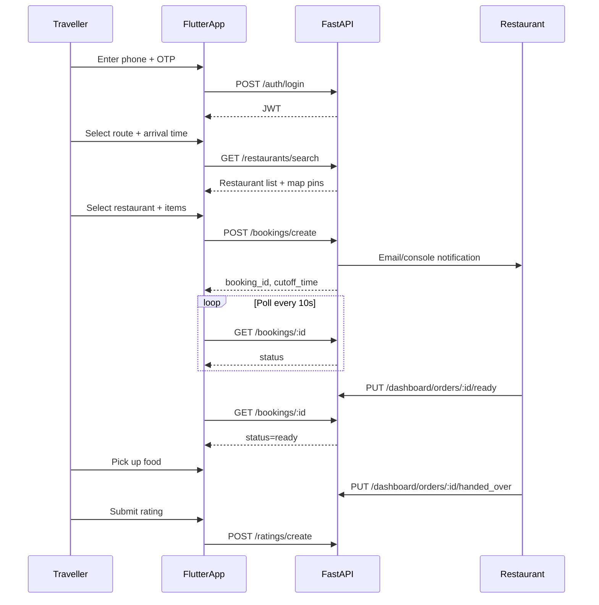
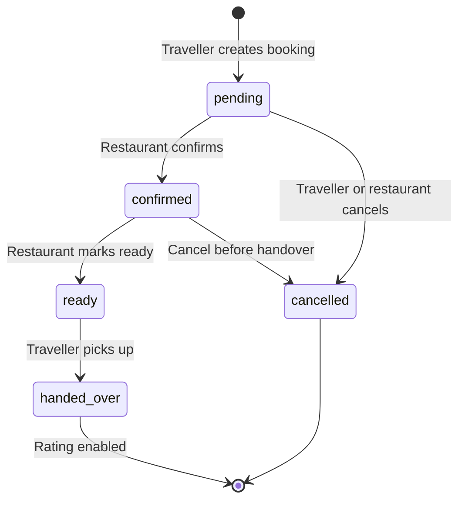

# Product Specification — Highway Food Pre-Booking Platform

**Document version:** 1.0  
**Last updated:** 2026-07-25  
**Parent:** [00_PROJECT_CHARTER.md](./00_PROJECT_CHARTER.md)

---

## 1. Overview

This document defines **what** the product does for MVP: user stories, feature list, flows, edge cases, and acceptance criteria. Technical implementation is in [02_TECHNICAL_SPEC.md](./02_TECHNICAL_SPEC.md) and [05_API_SPEC.md](./05_API_SPEC.md).

---

## 2. Product Principles

1. **Time-first, not distance-first** — The booking anchor is *when the traveller arrives*, not how far the restaurant is from home.
2. **Simple before clever** — Manual restaurant onboarding beats automated OSM ingestion for reliability in MVP.
3. **Restaurant is a partner, not a gig worker** — Restaurants confirm orders; the platform does not auto-dispatch couriers.
4. **Pay later** — MVP collects payment on arrival; online payment is a Phase 2 extension point ([09_ARCHITECTURE_DECISIONS.md](./09_ARCHITECTURE_DECISIONS.md) ADR-0007).

---

## 3. User Stories

### 3.1 Traveller

| ID | Story | Priority |
|----|-------|----------|
| T1 | As a traveller, I want to log in with my phone number so I can book food quickly | P0 |
| T2 | As a traveller, I want to select my route (e.g. Delhi → Chandigarh) so I see relevant restaurants | P0 |
| T3 | As a traveller, I want to see restaurants near my route on a map and list so I can choose conveniently | P0 |
| T4 | As a traveller, I want to pick menu items and set my expected arrival time so food is ready when I stop | P0 |
| T5 | As a traveller, I want to track my order status so I know when to proceed to the restaurant | P0 |
| T6 | As a traveller, I want to cancel before handover if my plans change | P1 |
| T7 | As a traveller, I want to rate hygiene, food quality, and timeliness after pickup | P1 |

### 3.2 Restaurant

| ID | Story | Priority |
|----|-------|----------|
| R1 | As a restaurant owner, I want to see pending orders sorted by cutoff time so I prioritize prep | P0 |
| R2 | As a restaurant owner, I want to confirm or reject orders before cooking starts | P0 |
| R3 | As a restaurant owner, I want to mark orders ready and handed over so travellers get accurate status | P0 |
| R4 | As a restaurant owner, I want to register my restaurant on the platform | P1 |
| R5 | As a restaurant owner, I want daily stats (orders, confirmation rate, avg rating) | P2 |

### 3.3 Internal Admin

| ID | Story | Priority |
|----|-------|----------|
| A1 | As an admin, I want to manually approve restaurant registrations | P2 (post-MVP) |

---

## 4. Feature Matrix

| Feature | MVP | Phase 2 | Notes |
|---------|-----|---------|-------|
| Phone + OTP login | ✅ | Enhance with real SMS | OTP stub `123456` in sprint |
| Route selection | ✅ | Custom origin/dest | 5 seeded routes in MVP |
| Restaurant search (corridor) | ✅ | PostGIS + OSM hybrid | See [02_TECHNICAL_SPEC.md](./02_TECHNICAL_SPEC.md) |
| Map view (MapLibre) | ✅ | Clustering, offline tiles | List-only fallback if map fails |
| Menu display | ✅ (dummy/hardcoded) | Full menu CRUD | |
| Timed booking | ✅ | Dynamic prep time ML | |
| Order status tracking | ✅ | WebSocket push | Poll every 10s in MVP |
| Restaurant dashboard | ✅ | Native restaurant app | Web console in MVP |
| Ratings | ✅ | Moderation, fraud detection | |
| Email notifications | ✅ (stub → live) | Push, SMS | |
| Online payments | ❌ | ✅ | Pay-on-arrival MVP |
| GPS live ETA | ❌ (ingest only) | ✅ ML model | `bus_gps_events` table reserved |
| OAuth | ❌ | Optional | |

---

## 5. Core User Flows

### 5.1 Traveller booking flow



### 5.2 Restaurant order management flow



**State transition rules:**

- `pending → confirmed | cancelled`
- `confirmed → ready | cancelled`
- `ready → handed_over` only
- **No reversals** from `handed_over` or backward from `ready`
- Cancellation blocked after `handed_over`

---

## 6. Key Business Rules

### 6.1 Cutoff time

```
cutoff_time = booking_time - prep_buffer_minutes
```

- Default `prep_buffer_minutes = 30` (configurable per restaurant via `avg_prep_time_minutes`)
- Restaurant dashboard sorts orders by `cutoff_time` ascending
- After cutoff passes without confirmation, restaurant may auto-reject (Phase 2); MVP: manual only

### 6.2 Ready-by time

```
ready_by = booking_time - 5 minutes
```

Restaurant should aim to have food ready 5 minutes before stated arrival to absorb minor delays.

### 6.3 Pricing

- MVP: item prices supplied in booking request (from menu display)
- `total_price = sum(item.price * item.qty)`
- No platform fee in MVP

### 6.4 Payment

- **Pay-on-arrival** at restaurant
- Booking record stores `payment_status = pending` always in MVP
- Payment provider interface reserved — see [05_API_SPEC.md](./05_API_SPEC.md) extension section

---

## 7. Screens & Navigation (MVP)

Detailed UX in [07_UI_UX_GUIDELINES.md](./07_UI_UX_GUIDELINES.md).

| Screen | Entry | Exit |
|--------|-------|------|
| Login | App launch | Search (on auth success) |
| Route Search | Login | Restaurant List |
| Restaurant List | Search | Restaurant Detail |
| Restaurant Detail | List | Booking Form |
| Booking Confirmation | Book action | Booking Status |
| Booking Status | Confirmation | Rating (on handed_over) |
| Rating | Status screen | Search (done) |
| Restaurant Dashboard | Separate tab/route | — |

---

## 8. Edge Cases

| Scenario | Expected behavior |
|----------|-------------------|
| Traveller arrives early | Status `ready` shown; restaurant already notified |
| Traveller arrives late (> 30 min) | Food may be cold; restaurant discretion; rating still allowed |
| Traveller no-show | Restaurant marks handed_over only on actual pickup; optional cancel after cutoff (Phase 2) |
| Restaurant rejects order | Status → `cancelled`; traveller notified via email |
| Restaurant closed | Manual rejection; traveller selects another restaurant |
| Overpass/OSM down | Fallback to seeded DB restaurants only ([03_SYSTEM_ARCHITECTURE.md](./03_SYSTEM_ARCHITECTURE.md)) |
| Duplicate booking same slot | Allowed in MVP; Phase 2: capacity limits per restaurant |
| Invalid OTP | 401 with clear message; MVP accepts only `123456` |
| JWT expired | 401; redirect to login |

---

## 9. Acceptance Criteria (MVP Demo)

### AC-1: Authentication

- [ ] User enters phone `+919876543210` and OTP `123456`
- [ ] System returns JWT valid for ≥ 24 hours
- [ ] `GET /user/profile` returns user phone and id with Bearer token

### AC-2: Restaurant discovery

- [ ] User selects route Delhi-Chandigarh
- [ ] Search returns ≥ 1 restaurant within 15 km of route corridor
- [ ] Second identical search responds from cache (< 100 ms)

### AC-3: Booking

- [ ] User creates booking with ≥ 1 item and future `booking_time`
- [ ] Response includes `booking_id`, `status=pending`, `cutoff_time`
- [ ] Restaurant dashboard lists the order sorted by cutoff

### AC-4: Status lifecycle

- [ ] Restaurant confirms → user poll shows `confirmed`
- [ ] Restaurant marks ready → user sees `ready`
- [ ] Restaurant marks handed_over → rating form enabled
- [ ] User submits rating → restaurant aggregate rating updates

### AC-5: Deployment

- [ ] Backend live on Render; Flutter/web points to production API URL
- [ ] End-to-end flow documented in `TEST_RESULTS.md` (sprint deliverable)

---

## 10. Out-of-Scope Reminder

Do not build in MVP: payments, SMS, ML ETA, OAuth, POS, analytics dashboards, automated testing suite (manual QA in final 2 hours of sprint).

---

## 11. Related Documents

- [04_DATABASE_DESIGN.md](./04_DATABASE_DESIGN.md) — Entity model for bookings, routes, ratings
- [05_API_SPEC.md](./05_API_SPEC.md) — Endpoint contracts
- [06_DESIGN_SYSTEM.md](./06_DESIGN_SYSTEM.md) — Visual language
- [07_UI_UX_GUIDELINES.md](./07_UI_UX_GUIDELINES.md) — Screen-level UX
- [13_ROADMAP.md](./13_ROADMAP.md) — Post-MVP features
