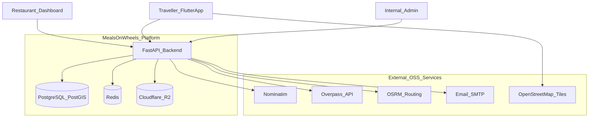
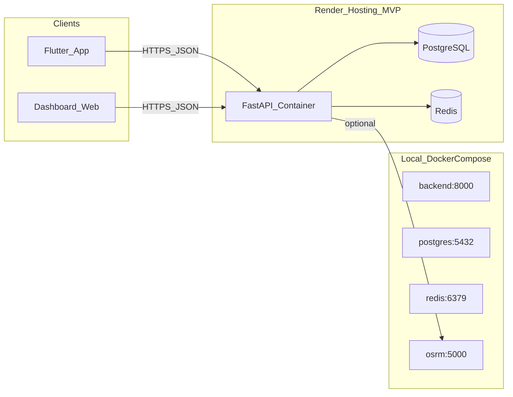
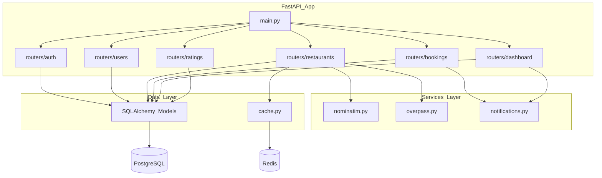
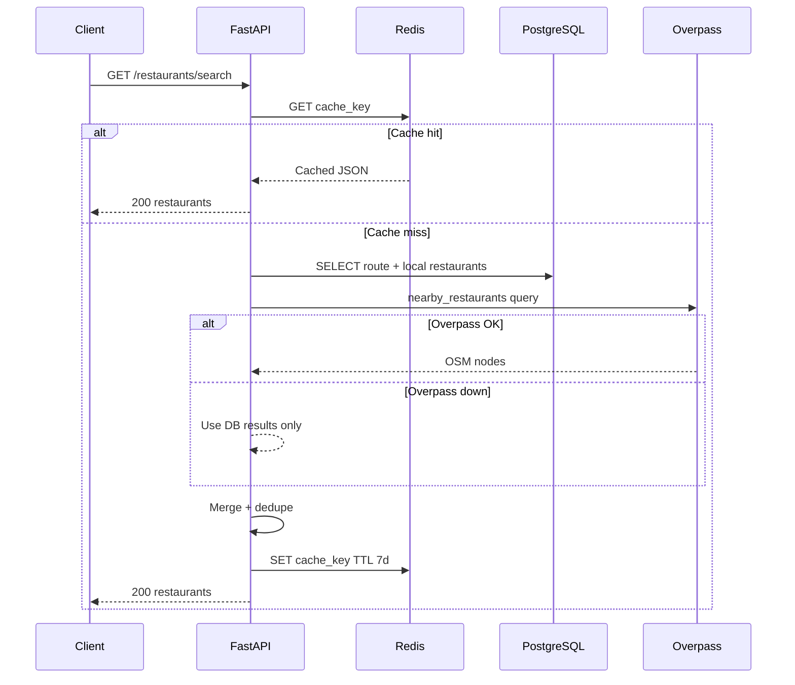
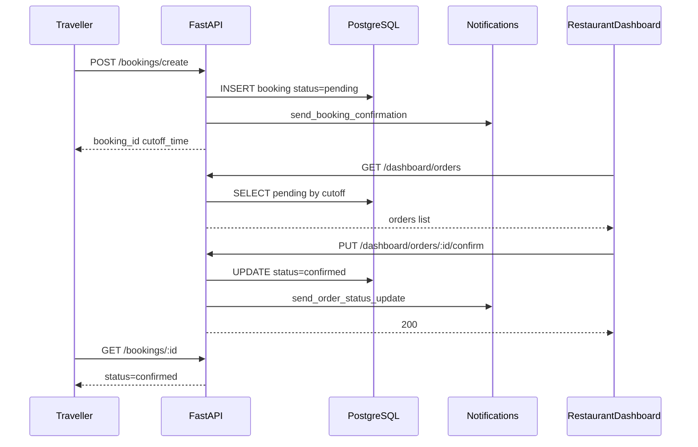
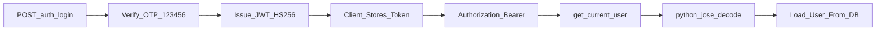
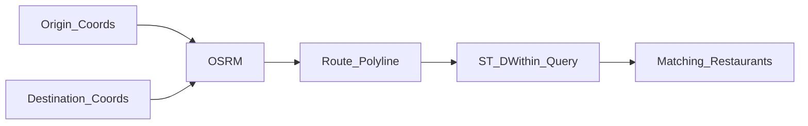
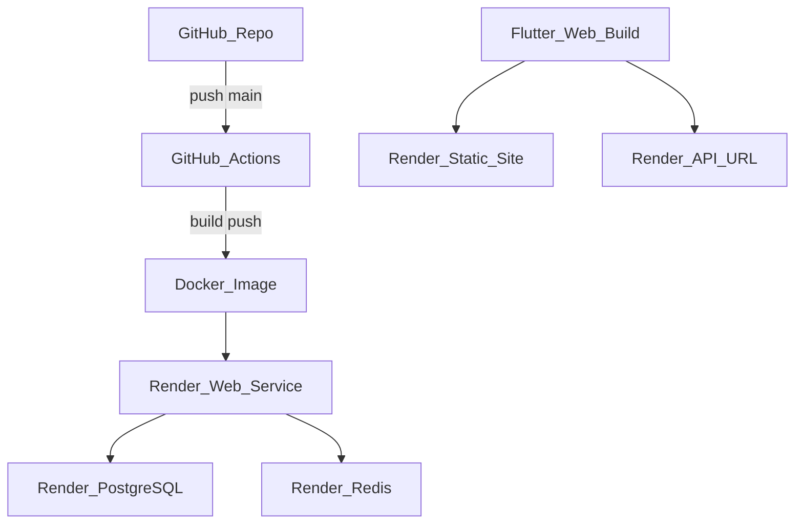

# System Architecture — Highway Food Pre-Booking Platform

**Document version:** 1.0  
**Last updated:** 2026-07-25  
**Parent:** [02_TECHNICAL_SPEC.md](./02_TECHNICAL_SPEC.md)

---

## 1. Architecture Overview

MealsOnWheels follows a **modular monolith** pattern: a single FastAPI deployable unit with clear internal module boundaries. This avoids microservice operational overhead in MVP while preserving clean seams for future extraction (notifications, ETA service).

**Design goals:**

- Open-source first, zero-cost where practical
- Simple before clever
- Security by default
- Horizontal scale path via stateless API + managed PostgreSQL/Redis

---

## 2. Context Diagram (C4 Level 1)

---

## 3. Container Diagram (C4 Level 2)

---

## 4. Backend Internal Structure

---

## 5. Request Flow — Restaurant Search

---

## 6. Request Flow — Booking Lifecycle

---

## 7. Authentication Architecture

**MVP:** Single access token, 24h expiry.  
**Phase 2:** Access (15 min) + refresh (7 days) in Redis; token blocklist on logout. See [10_SECURITY.md](./10_SECURITY.md).

---

## 8. Caching Strategy

| Layer | What | Invalidation |
|-------|------|--------------|
| Redis | Restaurant search results | TTL 7 days; manual flush on restaurant update |
| Redis | Nominatim reverse geocode | TTL 30 days |
| Client (Flutter) | JWT in SharedPreferences | On logout / 401 |
| PostgreSQL | Materialized views (Phase 2) | Nightly refresh for stats |

**Redis unavailable:** Application sets `REDIS_AVAILABLE=false` at startup and skips cache reads/writes. All requests hit DB and external APIs directly. Log warning once at boot.

---

## 9. Geospatial Architecture

### MVP (sprint)

- Point-radius search: restaurants within `radius_km` of `(latitude, longitude)`
- Overpass supplements OSM POIs not yet in local DB
- 10 manually seeded restaurants on Delhi-Chandigarh corridor

### Production (Phase 1.5)

- Route polylines stored as PostGIS `LINESTRING`
- Corridor buffer via `ST_DWithin(geography)`
- OSRM generates polylines when admin creates routes

---

## 10. Deployment Topology (Render MVP)

Details in [12_DEPLOYMENT.md](./12_DEPLOYMENT.md).

---

## 11. Failure Modes & Degradation

| Failure | System behavior |
|---------|-----------------|
| Redis down | Continue without cache; higher latency |
| Overpass timeout | Return DB-seeded restaurants only |
| Nominatim rate limit | Return cached or skip reverse geocode label |
| PostgreSQL down | 503 on all data endpoints; health check fails |
| OSRM down | Route polylines unavailable; point search still works |
| Email SMTP down | Log notification; booking still created |

---

## 12. Scalability Path

| Stage | Architecture |
|-------|--------------|
| MVP | Single Render web service, managed PG + Redis |
| 10K DAU | Horizontal API replicas behind load balancer; connection pooling (PgBouncer) |
| 100K DAU | Read replica for search; CDN for static assets; dedicated Overpass/Nominatim |
| 1M+ DAU | Extract notification service; event bus (Redis Streams → Kafka); ETA microservice |

No premature extraction in MVP.

---

## 13. Related Documents

- [04_DATABASE_DESIGN.md](./04_DATABASE_DESIGN.md)
- [05_API_SPEC.md](./05_API_SPEC.md)
- [09_ARCHITECTURE_DECISIONS.md](./09_ARCHITECTURE_DECISIONS.md)
- [10_SECURITY.md](./10_SECURITY.md)
- [12_DEPLOYMENT.md](./12_DEPLOYMENT.md)
