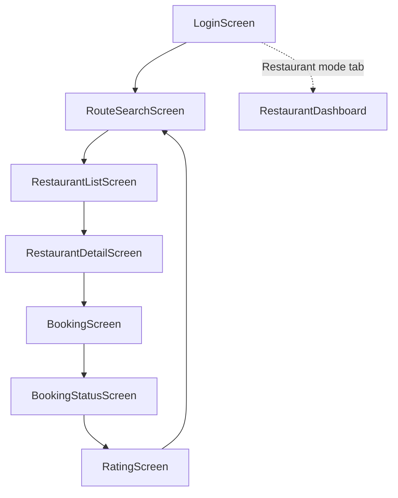

# UI/UX Guidelines — Highway Food Pre-Booking Platform

**Document version:** 1.0  
**Last updated:** 2026-07-25  
**Parent:** [01_PRODUCT_SPEC.md](./01_PRODUCT_SPEC.md), [06_DESIGN_SYSTEM.md](./06_DESIGN_SYSTEM.md)

---

## 1. UX Principles

1. **Three taps to book** — Login (once) → Search → Select restaurant → Confirm. Minimize form fields.
2. **Time is the hero** — Arrival time and cutoff countdown are visually dominant on every order screen.
3. **Progressive disclosure** — Show map + list together; details on tap; booking form only after restaurant selection.
4. **Fail gracefully** — Empty search, network errors, and expired sessions get actionable recovery paths.
5. **Restaurant speed** — Dashboard optimized for one-handed tablet use in a busy kitchen.

---

## 2. Information Architecture



**MVP navigation:** Bottom tab bar with two tabs — **Traveller** (default stack above) and **Restaurant** (dashboard). No deep nesting beyond 3 levels.

---

## 3. Screen Specifications

### 3.1 Login Screen

**Purpose:** Authenticate traveller via phone + OTP.

**Layout:**
- App logo + tagline: "Food ready when you arrive"
- Phone input with country code prefix (`+91` default)
- "Send OTP" button → reveals OTP field (MVP: skip send, show OTP field immediately)
- OTP input (6 digits)
- "Login" primary button

**Validation:**
- Phone: 10 digits after country code
- OTP: exactly 6 digits

**Error states:**
- Invalid OTP: inline error "Incorrect code. Try again."
- Network error: snackbar with retry

**Accessibility:**
- Phone field: `autocomplete="tel"`
- OTP field: `inputmode="numeric"`, label "One-time password"

---

### 3.2 Route Search Screen

**Purpose:** Select route and set expected arrival time.

**Layout:**
- Route dropdown (5 seeded routes)
- Current location display (mock: "Near Murthal, NH-44 (29.02, 77.02)" — the canonical demo
  coordinate from [05_API_SPEC.md](./05_API_SPEC.md) §6.1)
- Date/time picker for `arrival_time` (default: now + 2 hours)
- "Search restaurants" primary button

**Behavior:**
- Minimum booking time: now + 30 minutes
- Maximum booking time: now + 48 hours

**Empty/error:**
- No route selected: disable search button with helper text

---

### 3.3 Restaurant List Screen

**Purpose:** Browse restaurants on route; choose where to eat.

**Layout:**
- Toggle: **List** | **Map** (segmented control)
- List view: scrollable `RestaurantCard` components ([06_DESIGN_SYSTEM.md](./06_DESIGN_SYSTEM.md))
- Map view: MapLibre with pins; tap pin → bottom sheet preview → "View menu"
- Sort: distance (default), rating

**Loading:** Skeleton cards (3 placeholders) while API loads.

**Empty state:** "No restaurants found along this route. Try expanding search radius." + retry button.

**Pull-to-refresh:** Re-fetches search (bypasses cache with `?refresh=true` in Phase 2).

---

### 3.4 Restaurant Detail Screen

**Purpose:** View restaurant info and menu before booking.

**Layout:**
- Header: name, hygiene rating stars, distance, prep time estimate
- Address + phone (tap to call)
- Menu list (MVP: 3 hardcoded items per restaurant)
- Each item: name, price, quantity stepper (0–10)
- Sticky footer: total price + "Continue to booking"

**Validation:** At least 1 item with qty > 0 to proceed.

---

### 3.5 Booking Screen

**Purpose:** Confirm order details and submit.

**Layout:**
- Summary card: restaurant, arrival time, items, total
- Notes text field (optional, max 200 chars)
- Payment note: "Pay at restaurant on pickup" (informational banner)
- "Confirm booking" primary button

**Success:** Navigate to Booking Status with booking ID.

**Error:** Inline validation; server errors as snackbar.

---

### 3.6 Booking Status Screen

**Purpose:** Track order through lifecycle.

**Layout:**
- Status stepper: Pending → Confirmed → Ready → Handed Over
- Current status highlighted with semantic color
- Countdown to arrival time
- Booking ID (mono font, copyable)
- Restaurant name + address
- "Cancel order" text button (hidden if handed_over)

**Polling:** `GET /bookings/:id` every 10 seconds (MVP). Stop polling on terminal states (`handed_over`, `cancelled`).

**Handed over:** Show "Rate this order" primary button.

---

### 3.7 Rating Screen

**Purpose:** Post-pickup feedback.

**Layout:**
- Three star rating rows: Hygiene, Food Quality, Timeliness (1–5 each)
- Comment text area (optional)
- "Submit rating" button

**Validation:** All three scores required.

**Success:** Thank you message → navigate to Search.

---

### 3.8 Restaurant Dashboard Screen

**Purpose:** Restaurant staff manage incoming orders.

**Layout:**
- Filter chips: Pending | Confirmed | Ready | All
- Order cards sorted by cutoff time (earliest first)
- Each card:
  - Countdown to cutoff (prominent)
  - Masked user phone: `+919****3210`
  - Item list + notes
  - Action buttons based on status:
    - `pending` → Confirm | Reject (cancel)
    - `confirmed` → Mark Ready
    - `ready` → Mark Handed Over

**Touch targets:** Buttons minimum 48 dp height for kitchen tablet use.

**Stats tab (P2):** Daily order count, confirmation rate, avg rating from `/dashboard/stats`.

---

## 4. Copy & Tone

| Context | Tone | Example |
|---------|------|---------|
| Success | Warm, brief | "Your order is confirmed! Food will be ready by 7:25 AM." |
| Cutoff warning | Urgent, clear | "Restaurant must confirm within 45 minutes." |
| Error | Helpful, no blame | "We couldn't reach the server. Check your connection and try again." |
| Payment | Informative | "No online payment needed. Pay at the restaurant when you pick up." |

Avoid jargon. Use " arrival time" not "ETA" in user-facing copy (ETA reserved for internal/Phase 2).

---

## 5. Accessibility (WCAG 2.1 AA)

| Requirement | Implementation |
|-------------|----------------|
| Color contrast | 4.5:1 minimum for body text; 3:1 for large text |
| Touch targets | 48×48 dp minimum |
| Screen reader | Semantic labels on all interactive elements |
| Focus order | Logical tab order on web dashboard |
| Motion | Respect `prefers-reduced-motion` |
| Font scaling | Support up to 200% without layout break |

**Status stepper:** Each step has `aria-current="step"` on active step.

**Map:** List view is always available as accessible alternative to map pins.

---

## 6. Responsive Behavior

| Breakpoint | Layout |
|------------|--------|
| Mobile (< 600 dp) | Single column; map full width |
| Tablet (600–900 dp) | List + map side-by-side on Restaurant List |
| Desktop (dashboard web) | Table layout for orders |

Flutter MVP targets mobile portrait; dashboard usable on tablet landscape.

---

## 7. Offline & Low-Connectivity

| Scenario | UX |
|----------|-----|
| No network on search | Show cached last search if available; else error with retry |
| Network lost during poll | Pause polling; show "Connection lost" banner; resume on reconnect |
| JWT expired mid-session | Redirect to login with message "Session expired" |

No offline booking in MVP.

---

## 8. Wireframe Reference (ASCII)

### Booking Status Stepper

```
  ●────────●────────○────────○
Pending  Confirmed  Ready   Picked up
         ▲ you are here
         
  Arriving in: 1h 23m
  Booking #42
```

### Restaurant Dashboard Order Card

```
┌──────────────────────────────────────┐
│ ⏱ 45 min until cutoff    [PENDING]  │
│ +919****3210                         │
│ 2× Paneer Paratha, 1× Lassi         │
│ Note: Less spicy                     │
│                                      │
│  [ Confirm ]        [ Reject ]     │
└──────────────────────────────────────┘
```

---

## 9. Related Documents

- [06_DESIGN_SYSTEM.md](./06_DESIGN_SYSTEM.md) — Tokens and components
- [05_API_SPEC.md](./05_API_SPEC.md) — Data driving each screen
- [01_PRODUCT_SPEC.md](./01_PRODUCT_SPEC.md) — Business rules and flows
- [11_TESTING.md](./11_TESTING.md) — Manual test scenarios
