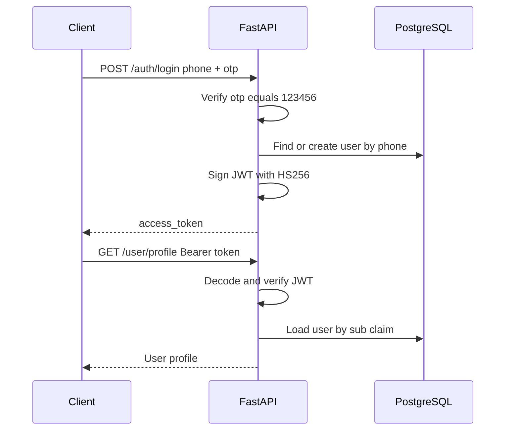

# Security — Highway Food Pre-Booking Platform

**Document version:** 1.0  
**Last updated:** 2026-07-25  
**Parent:** [05_API_SPEC.md](./05_API_SPEC.md), [09_ARCHITECTURE_DECISIONS.md](./09_ARCHITECTURE_DECISIONS.md)

---

## 1. Security Principles

1. **Security by default** — HTTPS everywhere in production; secrets never in source control
2. **Least privilege** — Services access only required resources
3. **Validate all inputs** — Server-side validation via Pydantic; never trust client
4. **Defense in depth** — Multiple layers: transport, auth, application, data
5. **Fail secure** — Auth failures deny access; Redis down does not bypass auth

---

## 2. Threat Model (STRIDE)

| Threat | Category | Asset | Mitigation |
|--------|----------|-------|------------|
| OTP brute force | Spoofing | User accounts | Rate limit login (10/hr/phone); replace stub OTP pre-launch |
| JWT theft (XSS) | Spoofing | Session | Short-lived tokens (Phase 2); HTTPS only; Flutter secure storage |
| Booking ID enumeration | Information disclosure | Order data | Auth required; user can only access own bookings |
| SQL injection | Tampering | Database | SQLAlchemy parameterized queries; no raw string SQL |
| Mass assignment | Tampering | Booking status | Status changes only via dashboard endpoints with validation |
| Overpass SSRF | Elevation | Backend network | Fixed Overpass URL from env; no user-supplied URLs |
| DDoS on search | Denial of service | API availability | Rate limiting; Redis cache; Render auto-scale (paid tier) |
| PII leakage in logs | Information disclosure | Phone numbers | Mask phone in logs and dashboard display |

---

## 3. Authentication & Authorization

### 3.1 MVP authentication flow

### 3.2 JWT specification

| Property | Value |
|----------|-------|
| Algorithm | HS256 |
| Secret | `JWT_SECRET` env var (≥ 32 random bytes) |
| Expiry | 24 hours (MVP) |
| Claims | `sub` (user_id), `phone`, `iat`, `exp` |
| Storage (client) | SharedPreferences (MVP); FlutterSecureStorage (Phase 2) |

### 3.3 Authorization model (MVP)

| Role | Capabilities |
|------|-------------|
| Traveller (authenticated) | Own profile, create/view/cancel own bookings, create ratings |
| Restaurant (unauthenticated MVP) | Dashboard endpoints with `restaurant_id` query param |
| Admin | Not implemented in MVP |

**MVP risk:** Dashboard endpoints are unauthenticated. **Mitigation for demo:** obscure URL; Phase 2 adds restaurant JWT with `restaurant_id` claim.

### 3.4 Phase 2 auth enhancements

- Access token (15 min) + refresh token (7 days) in Redis
- Token blocklist on logout
- Real SMS OTP with 5-minute expiry stored in Redis
- Restaurant staff accounts linked to `restaurant_id`

---

## 4. Input Validation

All request bodies validated by Pydantic schemas:

| Field | Validation |
|-------|------------|
| `phone` | E.164 regex `^\+[1-9]\d{6,14}$` |
| `otp` | Exactly 6 digits |
| `booking_time` | Future timestamp, ISO 8601 |
| `items[].qty` | Integer 1–99 |
| `items[].price` | Positive decimal, max 99999.99 |
| Rating scores | Integer 1–5 |
| `latitude` | -90 to 90 |
| `longitude` | -180 to 180 |

Reject unknown fields (`model_config = ConfigDict(extra="forbid")` on request schemas).

---

## 5. Transport Security

| Environment | Requirement |
|-------------|-------------|
| Production | HTTPS only (Render managed TLS) |
| Local dev | HTTP acceptable |
| HSTS | Enabled via Render/proxy in production |
| CORS | Explicit allowlist in `CORS_ORIGINS`; no `*` in production |

---

## 6. Secrets Management

| Secret | Storage | Rotation |
|--------|---------|----------|
| `JWT_SECRET` | Render env var / local `.env` | On compromise; quarterly in production |
| `DATABASE_URL` | Render env var | Render managed |
| `REDIS_URL` | Render env var | Render managed |
| SMTP credentials | Render env var (Stream E) | As needed |

**Rules:**
- `.env` in `.gitignore`
- `.env.example` contains placeholder values only
- GitHub Actions secrets for CI deploy
- Never log secrets or full JWTs

---

## 7. Data Protection & Privacy

### 7.1 PII inventory

| Data | Classification | Retention |
|------|----------------|-----------|
| Phone number | PII | Account lifetime |
| Email | PII | Account lifetime |
| Booking history | Sensitive | 2 years |
| GPS events | Sensitive | 90 days (Phase 2 policy) |

### 7.2 Display masking

- Dashboard shows phone as `+919****3210` (first 3 + last 4 visible)
- Logs mask phone: `+919****3210`

### 7.3 MVP privacy posture

- No cookie tracking
- No analytics SDK
- Email notifications opt-in via providing email at registration

### 7.4 Phase 2 compliance

- Account deletion API (anonymize phone to `deleted_<id>`)
- Data export on request
- FSSAI verification for restaurants (operational, not technical)

---

## 8. OWASP Top 10 Mitigations

| Risk | Mitigation |
|------|------------|
| A01 Broken Access Control | JWT on protected routes; booking ownership check |
| A02 Cryptographic Failures | HTTPS; strong JWT secret; bcrypt for future passwords |
| A03 Injection | SQLAlchemy ORM; parameterized queries |
| A04 Insecure Design | State machine prevents invalid status transitions |
| A05 Security Misconfiguration | `.env.example` documented; debug off in production |
| A06 Vulnerable Components | Dependabot / pip-audit in CI (Phase 2) |
| A07 Auth Failures | OTP rate limit; JWT expiry |
| A08 Data Integrity Failures | Server-side price calculation; FK constraints |
| A09 Logging Failures | Structured logging with request ID; no PII |
| A10 SSRF | Fixed external service URLs from config |

---

## 9. Rate Limiting

| Endpoint | Limit | Implementation |
|----------|-------|----------------|
| `POST /auth/login` | 10 / hour / phone | Redis counter (in-process fallback MVP) |
| `GET /restaurants/search` | 60 / min / IP | Redis counter |
| Nominatim client | 1 / sec global | asyncio throttle |
| Overpass client | 1 / sec global | asyncio throttle |

Return `429 RATE_LIMITED` with `Retry-After` header.

---

## 10. Pre-Launch Security Checklist

Before public launch (post-sprint):

- [ ] Replace OTP stub with real SMS provider
- [ ] Authenticate dashboard endpoints with restaurant JWT
- [ ] Rotate `JWT_SECRET` from development value
- [ ] Enable FlutterSecureStorage for token
- [ ] Run `pip-audit` and resolve critical CVEs
- [ ] Penetration test auth and booking endpoints
- [ ] Review Render security headers
- [ ] Enable audit logging for status transitions

---

## 11. Incident Response (MVP)

1. **Detect** — Render health alerts; error rate spike in logs
2. **Contain** — Rotate JWT secret (invalidates all sessions); disable affected endpoint
3. **Notify** — Internal team via email/Slack
4. **Recover** — Redeploy from known-good image; restore DB from backup if needed
5. **Review** — Post-incident ADR if architecture change required

---

## 12. Related Documents

- [05_API_SPEC.md](./05_API_SPEC.md)
- [09_ARCHITECTURE_DECISIONS.md](./09_ARCHITECTURE_DECISIONS.md) — ADR-0005, ADR-0007
- [12_DEPLOYMENT.md](./12_DEPLOYMENT.md)
