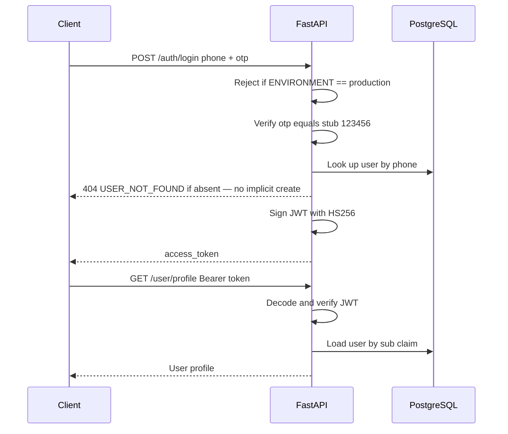

# Security — Highway Food Pre-Booking Platform

**Document version:** 1.0  
**Last updated:** 2026-07-25  
**Parent:** [05_API_SPEC.md](./05_API_SPEC.md), [09_ARCHITECTURE_DECISIONS.md](./09_ARCHITECTURE_DECISIONS.md)

---

## 1. Security Principles

1. **Security by default** — HTTPS everywhere in production; secrets never in source control
2. **Least privilege** — Services access only required resources
3. **Validate all inputs** — Server-side validation via Pydantic; never trust client
4. **Defense in depth** — Multiple layers: transport, auth, application, data
5. **Fail secure** — Auth failures deny access; Redis down does not bypass auth

---

## 2. Threat Model (STRIDE)

| Threat | Category | Asset | Mitigation |
|--------|----------|-------|------------|
| OTP brute force | Spoofing | User accounts | Rate limit login (10/hr/phone); stub OTP gated to `ENVIRONMENT != production`; real SMS before launch |
| Account creation under another person's phone | Spoofing | User identity | Login never auto-registers — unknown phone returns `404 USER_NOT_FOUND` |
| JWT theft (XSS) | Spoofing | Session | `flutter_secure_storage` (Keychain/Keystore); HTTPS only; short-lived tokens Phase 2 |
| Booking ID enumeration | Information disclosure | Order data | Auth required; ownership check on every read |
| Cross-restaurant order access | Broken access control | Order data, customer PII | `X-Restaurant-Token` **plus** per-request check that the booking belongs to the given `restaurant_id` |
| SQL injection | Tampering | Database | SQLAlchemy parameterized queries; no raw string SQL |
| Price tampering | Tampering | Revenue | Client cannot send prices; server resolves them from its own menu |
| Mass assignment | Tampering | Booking status | Status changes only via dashboard endpoints with state machine validation; `extra="forbid"` on all request schemas |
| Search poisoning via self-registration | Tampering | Search results | Registration requires a JWT and lands `is_active = false`; inactive rows never served |
| Overpass SSRF | Elevation | Backend network | Fixed Overpass URL from env; no user-supplied URLs |
| Endpoint map disclosure | Information disclosure | Attack surface | `/docs`, `/redoc`, `/openapi.json` disabled in production |
| DDoS on search | Denial of service | API availability | Rate limiting; Redis cache; Render auto-scale (paid tier) |
| PII leakage in logs | Information disclosure | Phone numbers | Mask phone in logs and dashboard display; never log JWTs |

---

## 3. Authentication & Authorization

### 3.1 MVP authentication flow

### 3.2 JWT specification

| Property | Value |
|----------|-------|
| Algorithm | HS256 |
| Secret | `JWT_SECRET` env var (≥ 32 random bytes) |
| Expiry | 24 hours (MVP) |
| Claims | `sub` (user_id), `phone`, `iat`, `exp` |
| Storage (client) | `flutter_secure_storage` — iOS Keychain / Android Keystore |

`SharedPreferences` is **not** acceptable, even in MVP. It stores plaintext readable by any
process with app-data access on a rooted or compromised device, and the token is valid for
24 hours. Using secure storage from the start costs one dependency; retrofitting it means
every stored token issued before the change is already exposed.

### 3.3 Authorization model

| Role | Authentication | Capabilities |
|------|---------------|--------------|
| Traveller | JWT (phone + OTP) | Own profile; create/view/cancel **own** bookings; rate own handed-over bookings; register a restaurant (inactive until approved) |
| Restaurant | Shared `X-Restaurant-Token` + `restaurant_id` ownership check | View and transition **that restaurant's** orders; view its stats |
| Operator | Direct database access | Activate registered restaurants |

**Ownership is checked on every access, not just authentication.** A traveller reading a
booking must own it; a dashboard request mutating a booking must supply the `restaurant_id`
that booking belongs to. Authentication answers "who is calling"; these checks answer "may
they touch this row" — the second question is where A01 failures actually happen.

**Transitional control, gated to non-production.** A single shared dashboard token cannot
distinguish one restaurant from another; anyone holding it can pass any `restaurant_id`. It
is adequate for a controlled demo and unacceptable publicly, so it is refused when
`ENVIRONMENT == production` and listed in §10 as launch-blocking.

The previous mitigation for these endpoints was "obscure URL". A secret URL is a password
that gets logged by every proxy, browser history, and referrer header along the way — it is
not a control, and it was protecting live customer data and irreversible state transitions.

### 3.4 Phase 2 auth enhancements

- Access token (15 min) + refresh token (7 days) in Redis
- Token blocklist on logout
- Real SMS OTP with 5-minute expiry stored in Redis
- Restaurant staff accounts linked to `restaurant_id`

---

## 4. Input Validation

All request bodies validated by Pydantic schemas:

| Field | Validation |
|-------|------------|
| `phone` | E.164 regex `^\+[1-9]\d{6,14}$` |
| `otp` | Exactly 6 digits |
| `arrival_time` | Future timestamp, ISO 8601; must be ≥ now + restaurant.avg_prep_time_minutes |
| `items[].name` | Must match a name on the restaurant's own menu; unknown names rejected |
| `items[].qty` | Positive integer |
| `items[].price` | **Not accepted from client** — field rejected with `extra="forbid"` |
| `items[].qty` | Integer 1–99 |
| `items[].price` | Positive decimal, max 99999.99 |
| Rating scores | Integer 1–5 |
| `latitude` | -90 to 90 |
| `longitude` | -180 to 180 |

Reject unknown fields (`model_config = ConfigDict(extra="forbid")` on request schemas).

---

## 5. Transport Security

| Environment | Requirement |
|-------------|-------------|
| Production | HTTPS only (Render managed TLS) |
| Local dev | HTTP acceptable |
| HSTS | Enabled via Render/proxy in production |
| CORS | Explicit allowlist in `CORS_ORIGINS`; no `*` in production |

---

## 6. Secrets Management

| Secret | Storage | Rotation |
|--------|---------|----------|
| `JWT_SECRET` | Render env var / local `.env` | On compromise; quarterly in production |
| `RESTAURANT_DASHBOARD_TOKEN` | Render env var / local `.env` | On compromise; superseded by per-restaurant JWTs at launch |
| `DATABASE_URL` | Render env var | Render managed |
| `REDIS_URL` | Render env var | Render managed |
| SMTP credentials | Render env var | As needed |

**Rules:**
- `.env` in `.gitignore`
- `.env.example` contains placeholder values only
- GitHub Actions secrets for CI deploy
- Never log secrets or full JWTs

---

## 7. Data Protection & Privacy

### 7.1 PII inventory

| Data | Classification | Retention |
|------|----------------|-----------|
| Phone number | PII | Account lifetime |
| Email | PII | Account lifetime |
| Booking history | Sensitive | 2 years |
| GPS events | Sensitive | 90 days (Phase 2 policy) |

### 7.2 Display masking

- Dashboard shows phone as `+919****3210` (first 3 + last 4 visible)
- Logs mask phone: `+919****3210`

### 7.3 MVP privacy posture

- No cookie tracking
- No analytics SDK
- Email notifications opt-in via providing email at registration

### 7.4 Phase 2 compliance

- Account deletion API (anonymize phone to `deleted_<id>`)
- Data export on request
- FSSAI verification for restaurants (operational, not technical)

---

## 8. OWASP Top 10 Mitigations

| Risk | Mitigation |
|------|------------|
| A01 Broken Access Control | JWT on protected routes; ownership verified on every booking read and every dashboard mutation |
| A02 Cryptographic Failures | HTTPS; strong JWT secret; secure on-device token storage |
| A03 Injection | SQLAlchemy ORM; parameterized queries |
| A04 Insecure Design | State machine prevents invalid status transitions; server owns prices and lead times |
| A05 Security Misconfiguration | `.env.example` documented; debug off and API docs disabled in production |
| A06 Vulnerable Components | `pip-audit` in CI |
| A07 Auth Failures | Login rate limit; JWT expiry; no implicit account creation; stub OTP unreachable in production |
| A08 Data Integrity Failures | Prices resolved server-side from the restaurant's own menu and frozen onto the booking; FK constraints |
| A09 Logging Failures | Structured logging with request ID; phones masked; JWTs never logged |
| A10 SSRF | Fixed external service URLs from config |

---

## 9. Rate Limiting

| Endpoint | Limit | Implementation |
|----------|-------|----------------|
| `POST /auth/login` | 10 / hour / phone | Redis counter; best-effort in-process fallback |
| `POST /auth/register` | 5 / hour / IP | Redis counter |
| `GET /restaurants/search` | 60 / min / IP | Redis counter |
| `POST /bookings/create` | 30 / hour / user | Redis counter |
| `POST /restaurants/register` | 5 / hour / user | Redis counter |
| `POST /ratings/create` | 20 / hour / user | Redis counter |
| Nominatim client | 1 / sec global | asyncio throttle |
| Overpass client | 1 / sec global | asyncio throttle |

Return `429 RATE_LIMITED` with a `Retry-After` header.

**When Redis is unavailable**, counters fall back to per-process memory and reset on
restart. On the Render free tier that means they reset on every cold start, so the login
limit in particular cannot be relied on. This is a second reason the stub OTP must be
unreachable in production: a constant password behind a resettable rate limit is no
protection at all.

---

## 10. Pre-Launch Security Checklist

Every item here **blocks public launch**. This is the gate referenced by
[13_ROADMAP.md](./13_ROADMAP.md) §7.

Three controls are currently satisfied by an `ENVIRONMENT != production` gate rather than by
a real mechanism. The gate means a misconfigured deploy fails closed instead of silently
exposing them — it is not a substitute for the work:

- [ ] **Replace the OTP stub** with a real SMS provider (MSG91 / Twilio), OTP stored in
      Redis with a 5-minute expiry
- [ ] **Replace the shared dashboard token** with per-restaurant JWTs carrying a
      `restaurant_id` claim, and keep the ownership check
- [ ] **Confirm `/docs`, `/redoc`, `/openapi.json` are disabled** in the production deploy

Then:

- [ ] Rotate `JWT_SECRET` from any development value
- [ ] Confirm tokens are stored in `flutter_secure_storage`, not `SharedPreferences`
- [ ] Confirm Redis-backed rate limiting is live (in-process fallback is not sufficient
      for a public login endpoint)
- [ ] Self-host Nominatim / Overpass, or move to a paid provider — the public instances'
      usage policies prohibit sustained production traffic regardless of throttling
- [ ] Run `pip-audit`; resolve critical CVEs
- [ ] Penetration test auth, booking ownership, and dashboard authorization
- [ ] Review Render security headers (HSTS, CSP)
- [ ] Enable audit logging for status transitions
- [ ] Verify no endpoint returns an unmasked phone number

---

## 11. Incident Response (MVP)

1. **Detect** — Render health alerts; error rate spike in logs
2. **Contain** — Rotate JWT secret (invalidates all sessions); disable affected endpoint
3. **Notify** — Internal team via email/Slack
4. **Recover** — Redeploy from known-good image; restore DB from backup if needed
5. **Review** — Post-incident ADR if architecture change required

---

## 12. Related Documents

- [05_API_SPEC.md](./05_API_SPEC.md)
- [09_ARCHITECTURE_DECISIONS.md](./09_ARCHITECTURE_DECISIONS.md) — ADR-0005, ADR-0007
- [12_DEPLOYMENT.md](./12_DEPLOYMENT.md)
