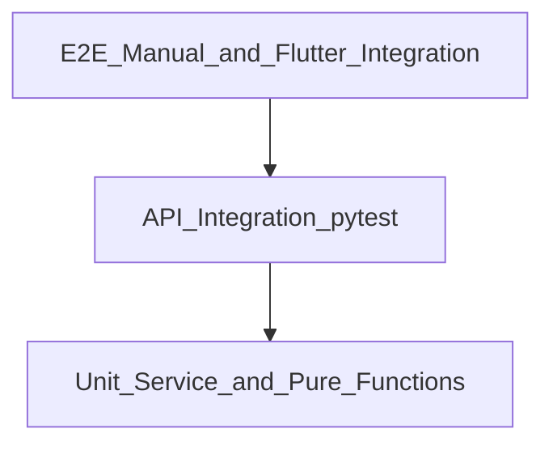

# Testing Strategy — Highway Food Pre-Booking Platform

**Document version:** 1.0  
**Last updated:** 2026-07-25  
**Parent:** [08_DEVELOPMENT_GUIDELINES.md](./08_DEVELOPMENT_GUIDELINES.md)

---

## 1. Testing Philosophy

**24-hour sprint rule:** Manual testing only in the final 2 hours. No automated test suite is a sprint deliverable.

**Post-sprint rule:** Build a test pyramid before public launch. Tests protect the booking state machine and auth flows — the highest-risk areas.

Principles:
- Test behavior, not implementation details
- Prefer integration tests for API endpoints over mocked unit tests
- Geospatial tests use fixed coordinate fixtures
- No tests that merely assert framework behavior

---

## 2. Test Pyramid (Post-Sprint Target)



| Layer | Target coverage | Tools |
|-------|-----------------|-------|
| Unit | 70% of service layer | pytest, pytest-asyncio |
| Integration | All API endpoints | pytest + httpx AsyncClient + test DB |
| E2E | Critical user paths | Manual checklist; Flutter integration_test |
| Load | Search endpoint | locust (Phase 2) |

---

## 3. Sprint Manual Test Plan (Final 2 Hours)

Document results in `TEST_RESULTS.md` at repo root.

### 3.1 Authentication

| # | Step | Expected |
|---|------|----------|
| A1 | POST login with valid phone + OTP 123456 | 200 + JWT |
| A2 | POST login with wrong OTP | 401 INVALID_OTP |
| A3 | GET profile with valid JWT | 200 user object |
| A4 | GET profile without token | 401 |

### 3.2 Restaurant search

| # | Step | Expected |
|---|------|----------|
| B1 | GET search Delhi-Chandigarh route | ≥ 1 restaurant |
| B2 | Repeat identical search | Faster response; cached=true |
| B3 | GET restaurant detail by id | Menu with 3 items |

### 3.3 Booking lifecycle

| # | Step | Expected |
|---|------|----------|
| C1 | POST create booking | 201 + booking_id + cutoff_time |
| C2 | GET booking status | status=pending |
| C3 | Dashboard confirm | status=confirmed |
| C4 | User poll booking | status=confirmed |
| C5 | Dashboard mark ready | status=ready |
| C6 | Dashboard mark handed_over | status=handed_over |
| C7 | POST rating | 201; restaurant rating updates |
| C8 | PUT cancel after handed_over | 400 INVALID_STATUS_TRANSITION |

### 3.4 End-to-end (Flutter)

| # | Step | Expected |
|---|------|----------|
| D1 | Login → search → select restaurant → book | Booking ID shown |
| D2 | Status screen polls | Updates through lifecycle |
| D3 | Dashboard confirm/ready/handover | Buttons work |
| D4 | Rate order after handover | Success message |

### 3.5 Deployment

| # | Step | Expected |
|---|------|----------|
| E1 | Hit production /health | database=connected |
| E2 | Full flow on production URL | Same as C1–C7 |

---

## 4. Backend Automated Tests (Post-Sprint)

### 4.1 Setup

```bash
cd backend
pip install -r requirements-dev.txt
pytest tests/ -v --cov=app --cov-report=term-missing
```

`requirements-dev.txt` includes: `pytest`, `pytest-asyncio`, `httpx`, `pytest-cov`, `factory-boy`.

### 4.2 Test database

- Separate database: `highway_food_booking_test`
- pytest fixture: create tables before session, truncate after each test
- Use `docker compose` test profile or pytest-postgresql

### 4.3 Key test modules

| File | Tests |
|------|-------|
| `tests/test_auth.py` | Login, register, invalid OTP, JWT expiry |
| `tests/test_bookings.py` | Create, state transitions, cancel rules |
| `tests/test_restaurants.py` | Search, cache hit, Overpass fallback |
| `tests/test_ratings.py` | Create, outlier exclusion, duplicate rejection |
| `tests/test_security.py` | Unauthorized access, ownership checks |

### 4.4 Booking state machine tests (critical)

```python
# Pseudocode — every valid and invalid transition must be tested
@pytest.mark.parametrize("from_status,to_status,expected_code", [
    ("pending", "confirmed", 200),
    ("pending", "cancelled", 200),
    ("confirmed", "ready", 200),
    ("ready", "handed_over", 200),
    ("handed_over", "cancelled", 400),  # invalid
    ("ready", "pending", 400),           # no reversal
])
async def test_status_transition(from_status, to_status, expected_code):
    ...
```

---

## 5. Flutter Tests (Post-Sprint)

### 5.1 Widget tests

| File | Coverage |
|------|----------|
| `test/widgets/restaurant_card_test.dart` | Renders name, rating, distance |
| `test/widgets/booking_form_test.dart` | Quantity validation |
| `test/screens/login_screen_test.dart` | OTP input validation |

### 5.2 Integration tests

```bash
flutter test integration_test/booking_flow_test.dart
```

Uses mock API server or staging backend. Tests login → search → book flow.

---

## 6. Geospatial Test Fixtures

Fixed coordinates for deterministic tests:

| Fixture | Lat | Lon | Purpose |
|---------|-----|-----|---------|
| `DELHI_CENTER` | 28.6139 | 77.2090 | Route origin |
| `CHANDIGARH_CENTER` | 30.7333 | 76.7794 | Route destination |
| `MURTHAL_Dhaba` | 29.0012 | 77.0123 | Seeded restaurant |
| `OUT_OF_RANGE` | 20.0000 | 75.0000 | Should return empty search |

---

## 7. CI Test Gates (Post-Sprint)

GitHub Actions job `test`:

```yaml
- Run ruff check
- Run black --check
- Run pytest with coverage (fail if < 60%)
- Run flutter analyze
- Run flutter test
```

MVP sprint CI: lint only, no test gate ([12_DEPLOYMENT.md](./12_DEPLOYMENT.md)).

---

## 8. Performance Testing (Phase 2)

| Scenario | Tool | Target |
|----------|------|--------|
| Search under load | locust | 100 RPS, P95 < 2s |
| Booking create | locust | 50 RPS, P95 < 500ms |
| DB query plans | EXPLAIN ANALYZE | Seq scan none on hot paths |

---

## 9. Related Documents

- [01_PRODUCT_SPEC.md](./01_PRODUCT_SPEC.md) — Acceptance criteria
- [05_API_SPEC.md](./05_API_SPEC.md) — Endpoint contracts to test against
- [08_DEVELOPMENT_GUIDELINES.md](./08_DEVELOPMENT_GUIDELINES.md) — Sprint testing exception
- [12_DEPLOYMENT.md](./12_DEPLOYMENT.md) — CI pipeline
