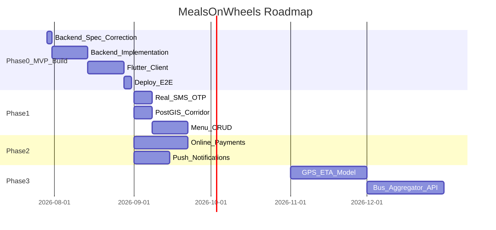

# Product Roadmap — Highway Food Pre-Booking Platform

**Document version:** 1.0  
**Last updated:** 2026-07-25  
**Parent:** [00_PROJECT_CHARTER.md](./00_PROJECT_CHARTER.md)

---

## 1. Roadmap Overview

Dates past Phase 0 are planning estimates, not commitments. Live status lives in
[14_BUILD_PLAN.md](./14_BUILD_PLAN.md).

---

## 2. Phase 0 — MVP Build (Current)

**Goal:** Working end-to-end product live on Render.

Sequenced as resumable stages in **[14_BUILD_PLAN.md](./14_BUILD_PLAN.md) §3** — that
document tracks live status and is the place to look for what is done and what is next.
This roadmap covers what comes after.

The original plan ran five parallel work streams against a 24-hour clock. That has been
replaced by sequential stages, each ending in a verified working state, because parallel
in-flight work is not recoverable if it is interrupted partway.

**Success criteria:** See [01_PRODUCT_SPEC.md](./01_PRODUCT_SPEC.md) AC-1 through AC-5.

**Explicitly deferred:** Payments, SMS, ML ETA, OAuth, admin panel. Automated tests are
**no longer deferred** — they ship with each stage ([11_TESTING.md](./11_TESTING.md)).

---

## 3. Phase 1 — Production Hardening (4 weeks after Phase 0)

**Goal:** Safe for limited public beta on one corridor (Delhi-Chandigarh).

| Feature | Description | Effort | Priority |
|---------|-------------|--------|----------|
| Real SMS OTP | MSG91 or Twilio integration; remove `123456` stub | 3 days | P0 |
| Restaurant dashboard auth | JWT with `restaurant_id` claim | 2 days | P0 |
| PostGIS corridor search | Replace point-radius with route buffer query | 5 days | P0 |
| Alembic migrations | Replace raw SQL migrations | 2 days | P1 |
| Menu CRUD | Normalized `menu_items` table; R2 image upload | 10 days | P1 |
| Automated tests | pytest + Flutter tests; CI gate | 5 days | P1 |
| Refresh tokens | Access 15 min + refresh 7 days in Redis | 3 days | P1 |
| Admin onboarding | Web form to approve restaurant registrations | 5 days | P2 |

**Exit criteria:**
- 50 real bookings on Delhi-Chandigarh corridor
- Zero critical security findings
- P95 search latency < 800 ms

---

## 4. Phase 2 — Growth Features (Months 2–3)

**Goal:** Revenue-ready platform on 5+ routes.

| Feature | Description | Effort |
|---------|-------------|------|
| Online payments | Razorpay UPI + cards; `services/payments.py` implementation | 3 weeks |
| Platform commission | Configurable fee on payment capture | 1 week |
| Push notifications | FCM for order status (replace polling) | 2 weeks |
| WebSocket status | Real-time booking updates | 1 week |
| Native restaurant app | Flutter app or PWA for dashboard | 2 weeks |
| Hindi localization | i18n for traveller app | 1 week |
| Dark mode | Design tokens already prepared ([06_DESIGN_SYSTEM.md](./06_DESIGN_SYSTEM.md)) | 3 days |
| Rating moderation | Flag/report inappropriate reviews | 1 week |

**Exit criteria:**
- 500 bookings/month
- Payment success rate > 95%
- Restaurant NPS > 40

---

## 5. Phase 3 — Intelligence & Integrations (Months 4–6)

**Goal:** Differentiated ETA-driven experience; B2B partnerships.

| Feature | Description | Extension point |
|---------|-------------|-----------------|
| GPS ETA model | Predict arrival from `bus_gps_events` | `services/eta.py` |
| Demand forecasting | Prep suggestions for restaurants | `services/demand.py` |
| Bus aggregator API | redBus/AbhiBus route + GPS feed | New integration module |
| Dynamic prep time | ML-adjusted `avg_prep_time_minutes` | Restaurant model |
| Route suggestions | "Best food stop for your arrival window" | AI ranking service |
| Multi-stop booking | Book at 2 restaurants on long routes | Booking schema extension |

**Exit criteria:**
- ETA prediction within ±10 min for 70% of bookings
- 1 bus operator integration live

---

## 6. Phase 4 — Scale & Enterprise (Months 7–12)

| Feature | Description |
|---------|-------------|
| Multi-region deploy | Secondary Render region or AWS migration |
| Read replicas | PostgreSQL read replica for search |
| Dedicated geo stack | Self-hosted Nominatim + Overpass + OSRM |
| FSSAI compliance module | Document verification workflow |
| Analytics dashboard | Restaurant and platform analytics |
| API for third parties | Public API with API keys |
| SLA monitoring | 99.9% uptime target |

---

## 7. Technical Debt Register

Shortcuts consciously accepted, with the condition that ends each one. Anything gated to
non-production **blocks public launch** until cleared —
[10_SECURITY.md](./10_SECURITY.md) §10 is the gate.

| Debt | Why accepted | Paydown |
|------|--------------|---------|
| OTP stub `123456` | No SMS provider yet; gated to non-production | Phase 1 — blocks launch |
| Shared dashboard token instead of per-restaurant accounts | Per-restaurant auth needs an onboarding flow that does not exist yet; gated to non-production | Phase 1 — blocks launch |
| Hardcoded menus | Menu CRUD is a Phase 1 feature. Prices are server-owned, so this is not a trust gap | Phase 1 (menu CRUD) |
| JSONB booking items | Normalising needs the menu table first | Phase 1 (menu CRUD) |
| Point-radius instead of corridor search | Route polylines not seeded yet | Phase 1 |
| Polling instead of WebSocket | Adequate at current scale | Phase 2 |
| Public Nominatim / Overpass instances | Usage policy prohibits sustained production traffic regardless of throttling | Self-host before launch |

**Resolved rather than carried** (were on this register; fixed instead):

| Was | Resolution |
|-----|------------|
| No automated tests | Tests now ship with each stage ([11_TESTING.md](./11_TESTING.md)) |
| Client-supplied item prices | Server validates every line item against its own menu |
| Provider instead of Riverpod | Riverpod from the start — no migration to schedule |
| Manual restaurant seed only | Seed data plus authenticated self-registration |

---

## 8. Risk Register

| Risk | Likelihood | Impact | Mitigation |
|------|------------|--------|------------|
| OSM coverage gaps | High | Medium | Manual seeding; restaurant self-registration |
| Render free tier cold starts | High | Low (demo) | Paid tier for beta |
| Restaurant adoption | Medium | High | Onboard 10 dhabas manually on one corridor |
| Traveller no-show | Medium | Medium | Cutoff time; restaurant cancel policy |
| OTP abuse pre-launch | High | High | Block public launch until real SMS |
| Overpass rate limits | Medium | Medium | Redis cache; self-hosted Overpass Phase 4 |

---

## 9. Success Milestones

| Milestone | Target date | Metric |
|-----------|-------------|--------|
| MVP live | End of Phase 0 | E2E flow on Render |
| Closed beta | +4 weeks | 50 bookings, 10 restaurants |
| Open beta | +8 weeks | 500 bookings/month |
| Paid launch | +12 weeks | First online payment |
| Series A metrics | +12 months | 10K MAU, 3 corridors |

---

## 10. Related Documents

- [00_PROJECT_CHARTER.md](./00_PROJECT_CHARTER.md)
- [01_PRODUCT_SPEC.md](./01_PRODUCT_SPEC.md)
- [09_ARCHITECTURE_DECISIONS.md](./09_ARCHITECTURE_DECISIONS.md)
- [11_TESTING.md](./11_TESTING.md)
- [12_DEPLOYMENT.md](./12_DEPLOYMENT.md)
