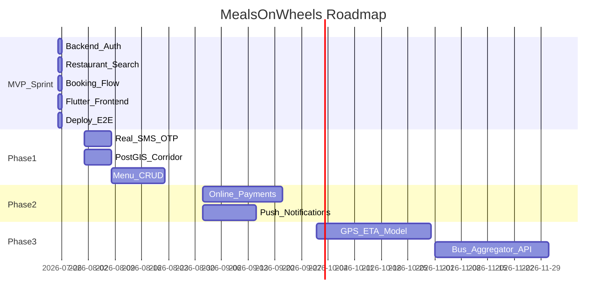

# Product Roadmap — Highway Food Pre-Booking Platform

**Document version:** 1.0  
**Last updated:** 2026-07-25  
**Parent:** [00_PROJECT_CHARTER.md](./00_PROJECT_CHARTER.md)

---

## 1. Roadmap Overview

---

## 2. Phase 0 — 24-Hour Sprint (Current)

**Goal:** Demoable end-to-end product live on Render.

| Stream | Deliverable | Hours |
|--------|-------------|-------|
| A | FastAPI skeleton, DB schema, phone+OTP auth, JWT | 0–6 |
| B | Restaurant search (Overpass + cache + seed data) | 0–8 |
| C | Booking flow, dashboard API, ratings | 4–16 |
| D | Flutter app (login, search, book, status, dashboard) | 6–18 |
| E | Email notifications, Render deploy, E2E test | 16–24 |

**Success criteria:** See [01_PRODUCT_SPEC.md](./01_PRODUCT_SPEC.md) AC-1 through AC-5.

**Explicitly deferred:** Payments, SMS, ML ETA, OAuth, automated tests, admin panel.

---

## 3. Phase 1 — Production Hardening (Weeks 1–4 post-sprint)

**Goal:** Safe for limited public beta on one corridor (Delhi-Chandigarh).

| Feature | Description | Effort | Priority |
|---------|-------------|--------|----------|
| Real SMS OTP | MSG91 or Twilio integration; remove `123456` stub | 3 days | P0 |
| Restaurant dashboard auth | JWT with `restaurant_id` claim | 2 days | P0 |
| PostGIS corridor search | Replace point-radius with route buffer query | 5 days | P0 |
| Alembic migrations | Replace raw SQL migrations | 2 days | P1 |
| Menu CRUD | Normalized `menu_items` table; R2 image upload | 10 days | P1 |
| Automated tests | pytest + Flutter tests; CI gate | 5 days | P1 |
| Refresh tokens | Access 15 min + refresh 7 days in Redis | 3 days | P1 |
| Admin onboarding | Web form to approve restaurant registrations | 5 days | P2 |

**Exit criteria:**
- 50 real bookings on Delhi-Chandigarh corridor
- Zero critical security findings
- P95 search latency < 800 ms

---

## 4. Phase 2 — Growth Features (Months 2–3)

**Goal:** Revenue-ready platform on 5+ routes.

| Feature | Description | Effort |
|---------|-------------|------|
| Online payments | Razorpay UPI + cards; `services/payments.py` implementation | 3 weeks |
| Platform commission | Configurable fee on payment capture | 1 week |
| Push notifications | FCM for order status (replace polling) | 2 weeks |
| WebSocket status | Real-time booking updates | 1 week |
| Native restaurant app | Flutter app or PWA for dashboard | 2 weeks |
| Hindi localization | i18n for traveller app | 1 week |
| Dark mode | Design tokens already prepared ([06_DESIGN_SYSTEM.md](./06_DESIGN_SYSTEM.md)) | 3 days |
| Rating moderation | Flag/report inappropriate reviews | 1 week |

**Exit criteria:**
- 500 bookings/month
- Payment success rate > 95%
- Restaurant NPS > 40

---

## 5. Phase 3 — Intelligence & Integrations (Months 4–6)

**Goal:** Differentiated ETA-driven experience; B2B partnerships.

| Feature | Description | Extension point |
|---------|-------------|-----------------|
| GPS ETA model | Predict arrival from `bus_gps_events` | `services/eta.py` |
| Demand forecasting | Prep suggestions for restaurants | `services/demand.py` |
| Bus aggregator API | redBus/AbhiBus route + GPS feed | New integration module |
| Dynamic prep time | ML-adjusted `avg_prep_time_minutes` | Restaurant model |
| Route suggestions | "Best food stop for your arrival window" | AI ranking service |
| Multi-stop booking | Book at 2 restaurants on long routes | Booking schema extension |

**Exit criteria:**
- ETA prediction within ±10 min for 70% of bookings
- 1 bus operator integration live

---

## 6. Phase 4 — Scale & Enterprise (Months 7–12)

| Feature | Description |
|---------|-------------|
| Multi-region deploy | Secondary Render region or AWS migration |
| Read replicas | PostgreSQL read replica for search |
| Dedicated geo stack | Self-hosted Nominatim + Overpass + OSRM |
| FSSAI compliance module | Document verification workflow |
| Analytics dashboard | Restaurant and platform analytics |
| API for third parties | Public API with API keys |
| SLA monitoring | 99.9% uptime target |

---

## 7. Technical Debt Register

Items consciously accepted in sprint; scheduled for paydown:

| Debt | Introduced | Paydown phase |
|------|------------|---------------|
| OTP stub `123456` | Sprint | Phase 1 |
| Unauthenticated dashboard | Sprint | Phase 1 |
| JSONB booking items | Sprint | Phase 1 (menu CRUD) |
| Manual restaurant seed | Sprint | Phase 1 (self-registration) |
| Polling instead of WebSocket | Sprint | Phase 2 |
| No automated tests | Sprint | Phase 1 |
| Point-radius vs corridor search | Sprint | Phase 1 |
| Provider vs Riverpod in Flutter | Sprint | Phase 1 |

---

## 8. Risk Register

| Risk | Likelihood | Impact | Mitigation |
|------|------------|--------|------------|
| OSM coverage gaps | High | Medium | Manual seeding; restaurant self-registration |
| Render free tier cold starts | High | Low (demo) | Paid tier for beta |
| Restaurant adoption | Medium | High | Onboard 10 dhabas manually on one corridor |
| Traveller no-show | Medium | Medium | Cutoff time; restaurant cancel policy |
| OTP abuse pre-launch | High | High | Block public launch until real SMS |
| Overpass rate limits | Medium | Medium | Redis cache; self-hosted Overpass Phase 4 |

---

## 9. Success Milestones

| Milestone | Target date | Metric |
|-----------|-------------|--------|
| Sprint demo | Day 1 | E2E flow on Render |
| Closed beta | +4 weeks | 50 bookings, 10 restaurants |
| Open beta | +8 weeks | 500 bookings/month |
| Paid launch | +12 weeks | First online payment |
| Series A metrics | +12 months | 10K MAU, 3 corridors |

---

## 10. Related Documents

- [00_PROJECT_CHARTER.md](./00_PROJECT_CHARTER.md)
- [01_PRODUCT_SPEC.md](./01_PRODUCT_SPEC.md)
- [09_ARCHITECTURE_DECISIONS.md](./09_ARCHITECTURE_DECISIONS.md)
- [11_TESTING.md](./11_TESTING.md)
- [12_DEPLOYMENT.md](./12_DEPLOYMENT.md)
