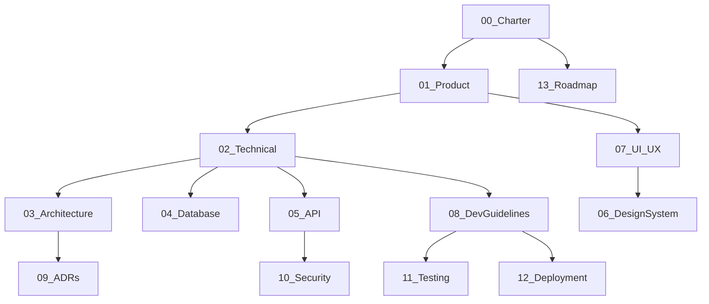

# MealsOnWheels Documentation

**Highway Food Pre-Booking Platform** — complete technical and product documentation for a system that lets travellers pre-order food from restaurants along their travel route.

> This is not a food delivery app. Food is **ready when the traveller arrives** at a highway stop.

---

## Quick Links

| Document | Description |
|----------|-------------|
| [00_PROJECT_CHARTER.md](./00_PROJECT_CHARTER.md) | Vision, goals, personas, scope |
| [01_PRODUCT_SPEC.md](./01_PRODUCT_SPEC.md) | User stories, flows, acceptance criteria |
| [02_TECHNICAL_SPEC.md](./02_TECHNICAL_SPEC.md) | Stack, modules, algorithms, NFRs |
| [03_SYSTEM_ARCHITECTURE.md](./03_SYSTEM_ARCHITECTURE.md) | Architecture diagrams, data flows |
| [04_DATABASE_DESIGN.md](./04_DATABASE_DESIGN.md) | Schema, ER diagram, PostGIS |
| [05_API_SPEC.md](./05_API_SPEC.md) | REST API contracts |
| [06_DESIGN_SYSTEM.md](./06_DESIGN_SYSTEM.md) | Colors, typography, components |
| [07_UI_UX_GUIDELINES.md](./07_UI_UX_GUIDELINES.md) | Screens, accessibility, copy |
| [08_DEVELOPMENT_GUIDELINES.md](./08_DEVELOPMENT_GUIDELINES.md) | Dev setup, code conventions |
| [09_ARCHITECTURE_DECISIONS.md](./09_ARCHITECTURE_DECISIONS.md) | ADR log with rationale |
| [10_SECURITY.md](./10_SECURITY.md) | Threat model, auth, OWASP |
| [11_TESTING.md](./11_TESTING.md) | Test strategy and smoke test plan |
| [12_DEPLOYMENT.md](./12_DEPLOYMENT.md) | Docker, Render, CI/CD |
| [13_ROADMAP.md](./13_ROADMAP.md) | Phased roadmap and risks |
| [14_BUILD_PLAN.md](./14_BUILD_PLAN.md) | **Build progress and handoff log — start here** |
| [15_DESIGN_BACKEND_ALIGNMENT.md](./15_DESIGN_BACKEND_ALIGNMENT.md) | Design vs backend — where they diverge and which is right |
| [16_FUNCTIONAL_PRODUCT_DATA.md](./16_FUNCTIONAL_PRODUCT_DATA.md) | Owner-managed menus and hours — **UI + backend changes, needs sign-off** |

---

## Technology Stack

| Layer | Technology |
|-------|------------|
| Mobile | Flutter |
| Backend | FastAPI (Python) |
| Database | PostgreSQL + PostGIS |
| Cache | Redis |
| Maps | MapLibre + OpenStreetMap |
| Geocoding | Nominatim |
| Routing | OSRM |
| Storage | Cloudflare R2 (Phase 2) |
| Auth | JWT + phone OTP |
| Containers | Docker |
| CI/CD | GitHub Actions |
| Hosting (MVP) | Render |

---

## Document Map

Read documents in this order when onboarding:



---

## Cross-Reference Index

| Topic | Primary doc | Also see |
|-------|-------------|----------|
| Booking state machine | [01_PRODUCT_SPEC.md](./01_PRODUCT_SPEC.md) | [05_API_SPEC.md](./05_API_SPEC.md), [04_DATABASE_DESIGN.md](./04_DATABASE_DESIGN.md) |
| Auth & JWT | [10_SECURITY.md](./10_SECURITY.md) | [05_API_SPEC.md](./05_API_SPEC.md), ADR-0005 |
| Restaurant search | [02_TECHNICAL_SPEC.md](./02_TECHNICAL_SPEC.md) | [03_SYSTEM_ARCHITECTURE.md](./03_SYSTEM_ARCHITECTURE.md) |
| Pay-on-arrival | ADR-0007 | [01_PRODUCT_SPEC.md](./01_PRODUCT_SPEC.md) |
| Local dev setup | [08_DEVELOPMENT_GUIDELINES.md](./08_DEVELOPMENT_GUIDELINES.md) | [12_DEPLOYMENT.md](./12_DEPLOYMENT.md) |
| Manual smoke tests | [11_TESTING.md](./11_TESTING.md) | [01_PRODUCT_SPEC.md](./01_PRODUCT_SPEC.md) AC section |
| Build progress / handoff | [14_BUILD_PLAN.md](./14_BUILD_PLAN.md) | [../CLAUDE.md](../CLAUDE.md) |
| MVP vs Phase 2 | [13_ROADMAP.md](./13_ROADMAP.md) | [00_PROJECT_CHARTER.md](./00_PROJECT_CHARTER.md) non-goals |

---

## Engineering Philosophy

- Open-source first
- Zero-cost where practical
- Simple before clever
- Maintainability over shortcuts
- Performance matters
- Accessibility matters
- Security by default
- Future AI features as extension points only
- Do not overengineer

---

## Repository Structure (Target)

```
MealsOnWheels/
├── docs/                 ← You are here
├── backend/              ← FastAPI API
├── mobile/               ← Flutter app
├── dashboard/            ← Restaurant web console (Phase 2)
├── docker-compose.yml
└── .github/workflows/
```

---

## Getting Started

1. Read [00_PROJECT_CHARTER.md](./00_PROJECT_CHARTER.md) for product context
2. Follow [08_DEVELOPMENT_GUIDELINES.md](./08_DEVELOPMENT_GUIDELINES.md) for local setup
3. Reference [05_API_SPEC.md](./05_API_SPEC.md) when building clients
4. Check [09_ARCHITECTURE_DECISIONS.md](./09_ARCHITECTURE_DECISIONS.md) before proposing changes

---

## Document Conventions

- All timestamps UTC (ISO 8601)
- Phone numbers E.164 format
- API base path: `/api`
- No placeholder text — every doc is production-quality
- Mermaid diagrams for architecture and flows

---

*Maintained by the MealsOnWheels engineering team. Last updated: 2026-07-25.*
